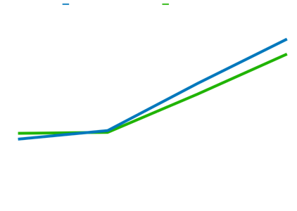

# Results from running performance-application

These are the results from several runs of `PerformanceApplicationNotScanning` and `PerformanceApplicationScanning` multiple 
times with varying amount of classes.
Ran on a 2022 MacBook Air M2 with 8GB of RAM

### Result from running with scanning
| Run no. ->              | 1       | 2       | 3       | 4       | 5       | 6       | 7       | 8       | 9       | 10      |
|-------------------------|---------|---------|---------|---------|---------|---------|---------|---------|---------|---------|
| Number of extra files V |         |         |         |         |         |         |         |         |         |         |
| 100                     | 0,873 s | 0,838 s | 0,824 s | 0,826 s | 1,164 s | 0,836 s | 0,835 s | 0,83 s  | 0,846 s | 0,818 s |
| 1 000                   | 0,981 s | 0,952 s | 0,946 s | 0,957 s | 0,942 s | 0,925 s | 0,971 s | 0,969 s | 0,96 s  | 0,937 s |
| 10 000                  | 1,606 s | 1,597 s | 1,536 s | 1,606 s | 1,606 s | 1,7 s   | 1,564 s | 1,631 s | 1,577 s | 1,605 s |
| 20 000                  | 2,409 s | 2,213 s | 2,175 s | 2,246 s | 2,25 s  | 2,193 s | 2,223 s | 2,226 s | 2,22 s  | 2,196 s |

### Result from running without scanning
| Run no. ->              | 1       | 2       | 3       | 4       | 5       | 6       | 7       | 8       | 9       | 10      |
|-------------------------|---------|---------|---------|---------|---------|---------|---------|---------|---------|---------|
| Number of extra files V |         |         |         |         |         |         |         |         |         |         |
| 100                     | 1,33 s  | 0,852 s | 0,87 s  | 0,915 s | 1,12 s  | 0,867 s | 0,918 s | 1,224 s | 0,836 s | 1,052 s |
| 1 000                   | 0,957 s | 0,942 s | 0,92 s  | 0,951 s | 0,886 s | 0,949 s | 0,929 s | 0,896 s | 0,93 s  | 0,93 s  |
| 10 000                  | 1,557 s | 1,436 s | 1,456 s | 1,477 s | 1,434 s | 1,451 s | 1,495 s | 1,442 s | 1,46 s  | 1,477 s |
| 20 000                  | 2,015 s | 2,188 s | 2,023 s | 2,042 s | 2,0 s   | 2,002 s | 2,013 s | 2,071 s | 1,952 s | 1,996 s |

### Here are the results plotted in a graph
